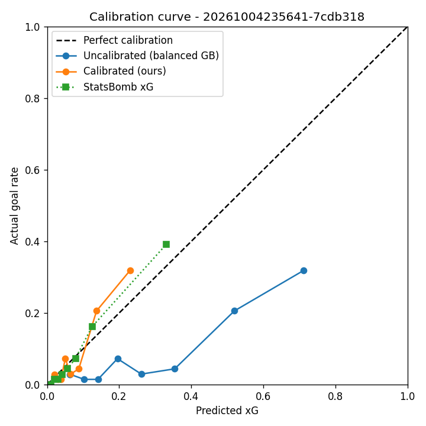
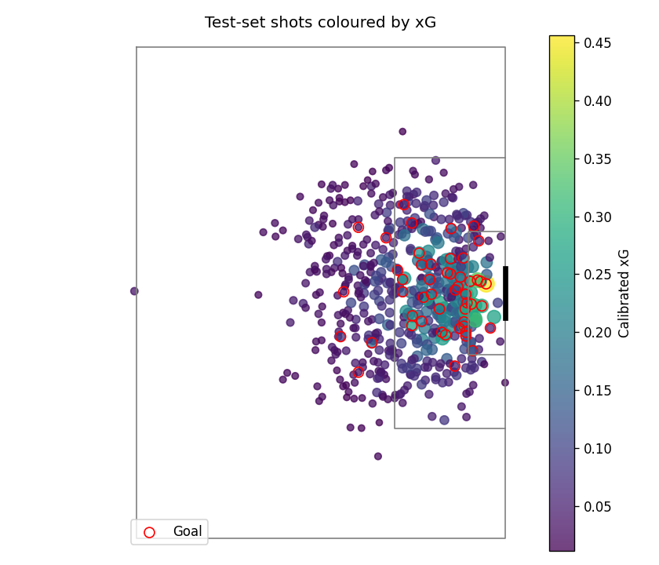
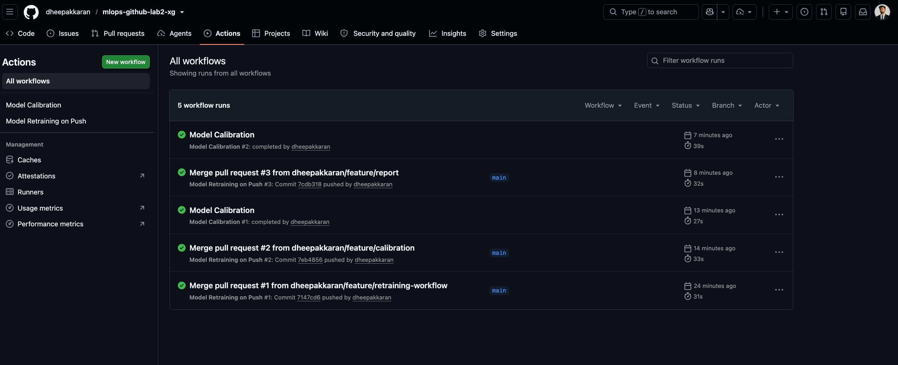
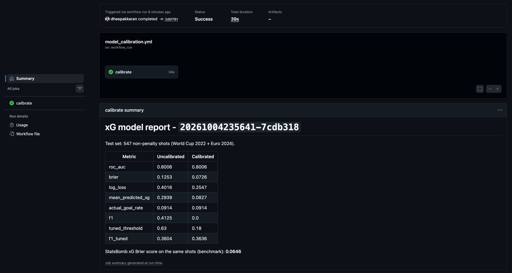
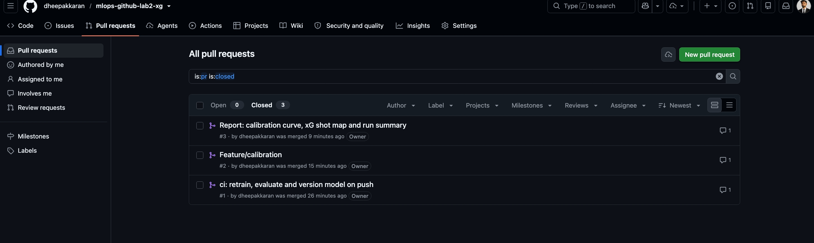

# ⚽ Lab 2: GitHub Actions for Model Training, Versioning and Calibration (Soccer xG Model)

This repository is my version of **GitHub Actions Lab 2** from the IE 7374 MLOps course.

The original lab trains a Random Forest on synthetic data. The assignment asked us to change the dataset, the model, or add a dashboard. I am a big soccer fan, so I changed all three and built an **expected goals (xG) model** using real shot data from the FIFA World Cup 2022 and UEFA Euro 2024.

Every time I push code changes, GitHub Actions automatically trains, evaluates, versions, calibrates and reports on the model.

## What is xG?

Expected goals (xG) is the probability that a shot becomes a goal. A shot with 0.30 xG is expected to go in about 30% of the time. Clubs and analysts use xG to judge chance quality, finishing and team performance.

## Why xG fits this lab

The lab has a separate workflow for **model calibration**, which makes sure predicted probabilities match real outcomes. For xG this is the most important property of the model. If shots rated 0.20 xG only go in 5% of the time, the numbers are useless. So in this project, calibration is not an extra step, it is the step that makes the model usable.

## What I Changed from the Original Lab

| | Original lab | My version |
|---|---|---|
| Dataset | Synthetic data (`make_classification`) | 2,734 real non-penalty shots (250 goals) from 115 matches, StatsBomb Open Data |
| Features | 6 random numbers | 9 soccer features (see below) |
| Model | Random Forest | Gradient Boosting with balanced class weights |
| Evaluation | F1 score on the training data | Held-out test set: F1, ROC-AUC, Brier score, log loss, compared with StatsBomb's own xG |
| Data split | None | 60% train / 20% calibration / 20% test |
| Model version | Timestamp | Timestamp + Git commit ID, so every model links to the exact code that built it |
| Calibration trigger | On push, at the same time as training | Runs automatically **after** training succeeds, so it always uses the new model |
| Dashboard | None | Calibration curve, xG shot map and a metrics report, updated on every run |
| Development | Single branch | Built step by step with feature branches and pull requests |

## Features

| Feature | Meaning |
|---|---|
| `distance` | Distance from the shot to the centre of the goal |
| `angle` | How wide the goal mouth looks from the shot position (bigger = easier) |
| `is_header` | The shot was a header |
| `first_time` | The shot was taken first time, without a controlling touch |
| `under_pressure` | A defender was pressing the shooter |
| `one_on_one` | The shooter was one-on-one with the goalkeeper |
| `from_free_kick` | Direct free kick |
| `from_counter` | The shot came from a counter attack |
| `from_set_piece` | The shot came from a corner, free kick or throw-in phase |

Penalties and shootout kicks are removed because their chance of scoring does not depend on these features.

## Project Structure

| Path | What it is |
|---|---|
| `.github/workflows/model_retraining_on_push.yml` | Workflow 1: train, evaluate and version the model |
| `.github/workflows/model_calibration.yml` | Workflow 2: calibrate the model and build the report |
| `src/fetch_data.py` | Downloads StatsBomb shots and builds `data/shots.csv` (run once, locally) |
| `src/data_utils.py` | Shared settings: file paths, feature list and the train / calibration / test split |
| `src/train_model.py` | Trains the model |
| `src/evaluate_model.py` | Calculates the metrics |
| `src/calibrate_model.py` | Calibrates the model with Platt scaling |
| `src/report.py` | Creates the charts and the report |
| `data/shots.csv` | The dataset |
| `models/` | Every model version (written by GitHub Actions) |
| `metrics/` | Metrics for every model version (written by GitHub Actions) |
| `reports/` | Latest charts and report (written by GitHub Actions) |
| `docs/images/` | Screenshots used in this README |

## Prerequisites

- GitHub account
- Python 3.11 (the same version GitHub Actions uses)
- Basic knowledge of Python, Git and machine learning

## Getting Started

1. **Clone the repository**
```bash
   git clone https://github.com/dheepakkaran/mlops-github-lab2-xg.git
   cd mlops-github-lab2-xg
```

2. **Create a virtual environment and install packages**
```bash
   python3 -m venv .venv
   source .venv/bin/activate
   pip install -r requirements.txt
```
   The versions in `requirements.txt` are pinned for Python 3.11. On a newer Python, use `pip install numpy pandas scikit-learn joblib matplotlib` instead.

3. **(Optional) Rebuild the dataset.** `data/shots.csv` is already in the repo.
```bash
   python src/fetch_data.py
```
   On macOS, if you see an SSL certificate error, run `pip install certifi` and `export SSL_CERT_FILE=$(python -m certifi)` first.

4. **Run the full pipeline locally**
```bash
   python src/train_model.py --version local
   python src/evaluate_model.py --version local
   python src/calibrate_model.py --version local
   python src/evaluate_model.py --version local --calibrated
   python src/report.py --version local
```

## Running the Workflow

1. Change something in `src/`, `data/` or `requirements.txt` and push it to `main`, or merge a pull request into `main`.
2. **Model Retraining on Push** starts automatically.
3. When it succeeds, **Model Calibration** starts automatically.
4. Follow the progress in the **Actions** tab. Both workflows can also be started by hand with **Run workflow**.
5. When both are done, run `git pull` to get the new model, metrics and report.

Changes to `README.md` or `docs/` do not start a retrain.

## GitHub Actions Workflow Details

### 1. Model Retraining on Push (`model_retraining_on_push.yml`)

| Step | What happens |
|---|---|
| Trigger | A push to `main` that changes `src/`, `data/`, `requirements.txt` or this workflow file |
| Set up | Check out the code, install Python 3.11 and the packages |
| Generate version | Build a version name from the UTC time and the short commit ID, for example `20261004235641-7cdb318` |
| Train | `train_model.py` trains the model on the training split and saves `models/xg_model_<version>.joblib` |
| Evaluate | `evaluate_model.py` scores the model on the test split and saves `metrics/<version>_metrics.json` |
| Commit and push | The GitHub Actions bot commits the new model and metrics back to the repository |

### 2. Model Calibration (`model_calibration.yml`)

| Step | What happens |
|---|---|
| Trigger | Starts when Model Retraining on Push finishes successfully (`workflow_run`) |
| Load model | Reads the newest version from `models/latest_version.txt` |
| Calibrate | `calibrate_model.py` applies Platt scaling (sigmoid) using the calibration split and saves `models/xg_model_<version>_calibrated.joblib` |
| Evaluate | Scores the calibrated model and saves `metrics/<version>_calibrated_metrics.json` |
| Report | `report.py` creates the calibration curve, the xG shot map, `reports/latest_report.md` and a metrics table on the Actions run page |
| Commit and push | The bot commits the calibrated model, metrics and report |

**Why I changed the trigger:** in the original lab, both workflows start on the same push at the same time, so the calibration workflow can load the old model before training finishes. Running calibration after training removes that problem.

## Model Versioning

Each run creates new files and keeps the old ones, so any model can be compared or rolled back:

```
models/xg_model_20261004235641-7cdb318.joblib
models/xg_model_20261004235641-7cdb318_calibrated.joblib
metrics/20261004235641-7cdb318_metrics.json
metrics/20261004235641-7cdb318_calibrated_metrics.json
```

The part after the dash (`7cdb318`) is the Git commit that produced the model.

## Results

Test set: 547 shots that the model never saw during training or calibration.

| Metric | Meaning | Before calibration | After calibration |
|---|---|---|---|
| ROC-AUC | How well the model ranks goals above non-goals (higher is better) | 0.8006 | 0.8006 |
| Brier score | Average squared error of the probabilities (lower is better) | 0.1253 | **0.0726** |
| Log loss | Penalty for confident wrong predictions (lower is better) | 0.4016 | **0.2547** |
| Mean predicted xG | Average predicted chance of a goal | 0.2939 | **0.0827** |
| Actual goal rate | Real share of shots that were goals | 0.0914 | 0.0914 |
| F1 at 0.5 | F1 when every shot above 0.5 counts as a goal | 0.4125 | 0.0 |
| Tuned threshold | Cut-off chosen on the calibration split | 0.63 | 0.18 |
| F1 at tuned threshold | F1 using the tuned cut-off | 0.3604 | 0.3636 |

StatsBomb's own xG, a professional model that uses much more information, gets a Brier score of **0.0646** on the same shots.

**What this shows:**

- Training with balanced class weights helps the model learn goals, but makes its probabilities too high. It predicts 29% on average when only 9% of shots are goals.
- Calibration fixes this. The average prediction drops to 8%, the Brier score drops from 0.125 to 0.073 and the log loss from 0.40 to 0.25.
- ROC-AUC stays at 0.80 because Platt scaling does not change the order of the shots, only the size of the probabilities.
- F1 at 0.5 drops to 0 after calibration because very few shots get an xG above 0.5. This is normal for xG. With a cut-off tuned on the calibration split, both models reach an F1 of about 0.36.
- After calibration, the model gets close to StatsBomb's xG (0.073 vs 0.065 Brier score) with only 9 simple features.

### Calibration curve



Points on the dashed line mean the predicted xG matches reality. The blue line (before calibration) sits far below it. The orange line (after calibration) is much closer, similar to StatsBomb's xG.

### xG shot map



Each dot is a test shot. Bigger and brighter dots have higher xG. Red circles are goals. High-xG shots are close to the goal and central.

Full report: [`reports/latest_report.md`](reports/latest_report.md)

## Screenshots

### GitHub Actions runs


### Metrics table on the run summary


### Pull requests


## Development History

I built this project in small steps. Each feature was developed on its own branch and merged with a pull request.

| PR | Branch | What it added |
|---|---|---|
| #1 | `feature/retraining-workflow` | Training, evaluation and versioning workflow |
| #2 | `feature/calibration` | Calibration workflow, tuned-threshold F1, GitHub Actions version updates |
| #3 | `feature/report` | Calibration curve, shot map and report |
| #4 | `docs/readme` | This README |

Commits starting with `ci:` were made automatically by the GitHub Actions bot. Full history: [commits on main](https://github.com/dheepakkaran/mlops-github-lab2-xg/commits/main)

## Acknowledgments

- Original lab: GitHub Actions Lab 2 from [raminmohammadi/MLOps](https://github.com/raminmohammadi/MLOps)
- Data: [StatsBomb Open Data](https://github.com/statsbomb/open-data)
- Built with Python, scikit-learn, pandas, matplotlib and GitHub Actions
